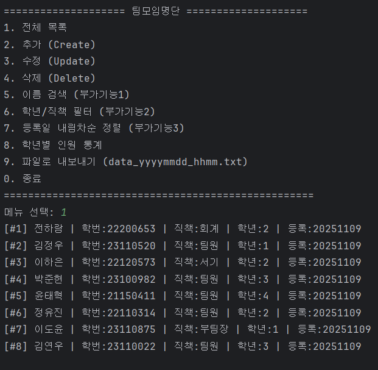
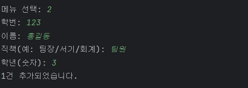
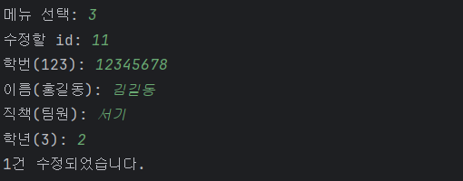
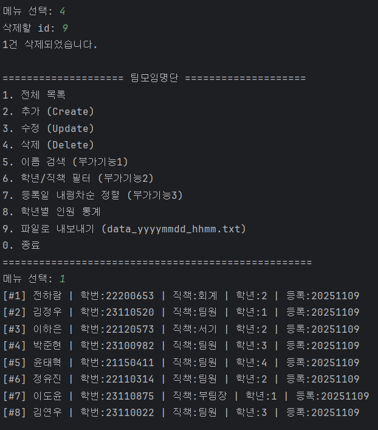
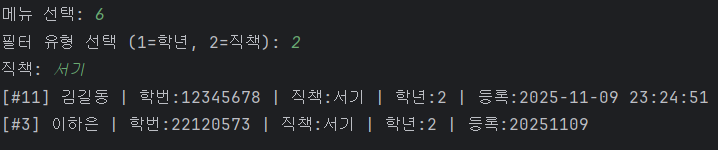
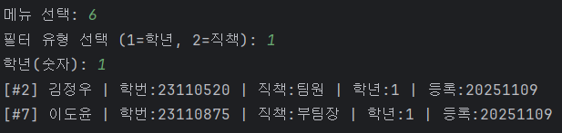
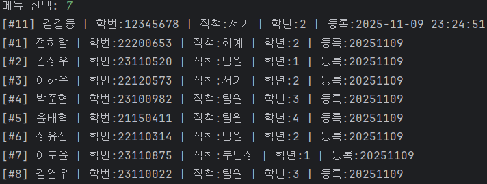
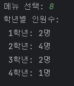
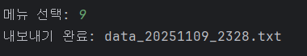

### 기능 1. 전체 목록 조회

### 기능 2. 추가 (Create)

### 기능 3. 수정 (Update)

### 기능 4. 삭제 (Delete)

### 기능 5. 이름 검색

### 기능 6. 학년 / 직책 필터

### 기능 7. 등록일 내림차순 정렬

### 기능 8. 학년별 인원 통계

### 기능 9. 파일 내보내기
